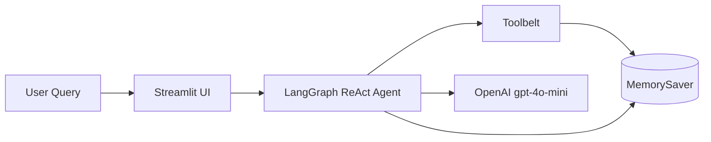

# 🤖 Gem Enterprise Agent with UI

A production‑ready AI assistant that can answer complex business questions by autonomously using tools: a web search engine, an employee database, a system clock, and a math engine. Built with **LangGraph**, **LangChain**, and a **Streamlit** chat interface.

---

## 🧠 What It Does

This is not a simple chatbot — it's an **agentic RAG system**. Given a single query, the agent decides *which tools to call*, *in what order*, and *how to combine the results* into a coherent answer. It handles multi‑step reasoning out of the box.

**Example query:**
> *"What's the exact time? Multiply 145 by 24. Show me employees in Engineering. What's the latest AI news?"*

The agent will:
1. Call `get_system_time` for the current time.
2. Call `calculate_multiplication(145, 24)` to get 3,480.
3. Run a SQL query on the employee database to fetch Engineering staff.
4. Search the web for the latest AI headlines.
5. Synthesize everything into a single natural‑language answer — all in a matter of seconds.

---

## 🏗️ Architecture


LangGraph orchestrates the agent's think‑act‑observe loop.

MemorySaver persists conversation history across turns.

Tools are defined as standard @tool functions with clear docstrings that the LLM reads.

## ✨ Key Features
✅ Autonomous tool selection – the agent decides which tools to use based on the user’s question.

✅ Multi‑step reasoning – handles queries that require multiple tools in sequence.

✅ Live streaming – watch the agent’s thought process in real time (both CLI and UI).

✅ Conversation memory – the agent remembers previous questions and answers.

✅ Modern LangChain (v0.3+) – uses the new create_agent API, not the deprecated legacy chains.

✅ Streamlit web UI – sleek chat interface with tool‑call indicators.

✅ Bullet‑proof error handling – friendly messages for empty responses, missing API keys, etc.

## 🛠️ Tech Stack
|   Component   |	Technology  |
|   :---    |   :---    |
|   Agent framework |	LangGraph + LangChain v0.3+ |
|   LLM |	OpenAI gpt-4o-mini  |
|   Tools   |	Web search (DuckDuckGo), SQLite DB, system clock, math  |
|   Memory  |	LangGraph MemorySaver   |
|   Web UI  |	Streamlit   |
|   Environment |	Python 3.11+, dotenv    |

## 🚀 Getting Started
### 1. Clone the repository
```bash
git clone https://github.com/<your-username>/gem-enterprise-agent-with-ui.git
cd gem-enterprise-agent-with-ui
```
### 2. Create a virtual environment & install dependencies
```bash
python -m venv venv

# On Windows:

venv\Scripts\activate

# On macOS/Linux:

source venv/bin/activate

pip install -r requirements.txt
```
If you don't have a requirements.txt, install the essential packages manually:

```bash
pip install streamlit langchain langchain-openai langchain-community langgraph chromadb python-dotenv ddgs
```
### 3. Set up your OpenAI API key
Create a .env file in the project root:

```text
OPENAI_API_KEY="sk-your-api-key-here"
```

## 🖥️ Usage
CLI Agent (Verbose Debug Mode)
Run the agent directly in your terminal to see every tool call and the final answer:

```bash
python graph_agent.py demo
```
For a multi‑turn conversation (with memory):

```bash
python graph_agent.py chat
```
## Streamlit Web App
Launch the browser‑based chat interface:

```bash
streamlit run app.py
```
Then open your browser to http://localhost:8501. You’ll see a professional chat UI where you can ask questions and watch the agent think in real time.

## 📂 Project Structure
```text
📦 gem-enterprise-agent-with-ui
 ┣ 📜 app.py                  # Streamlit chat interface
 ┣ 📜 graph_agent.py          # Agent definition, tools, CLI runner
 ┣ 📜 ingest.py               # (optional) Document ingestion for RAG
 ┣ 📜 search.py               # (optional) Semantic search for documents
 ┣ 📜 .env                    # API keys (git-ignored)
 ┣ 📜 .gitignore              # Prevents committing secrets & binaries
 ┣ 📜 README.md               # You are here!
 ┗ 📜 requirements.txt        # Python dependencies
 ```

## 🧪 Sample Queries
Try these in the UI or CLI to see the agent’s full capabilities:

Math + DB + Web: "What's 200 times 5, who works in Marketing, and what’s the latest tech news?"

Time + DB: "Current time? Also, show me all employees located in Berlin."

Multi‑step DB: "List every department and the number of employees in each." (requires reasoning from the LLM to write a SQL query)

## 🛡️ Guardrails & Error Handling
Missing OPENAI_API_KEY → raises a clear error on startup.

Empty tool results → agent gracefully indicates “no results found”.

Agent fails to generate an answer → fallback message shown to the user.

## 📈 Future Enhancements
Replace in‑memory SQLite with a real corporate database (PostgreSQL, Snowflake)

Add a document Q&A tool for company policies (the existing RAG pipeline)

Deploy with Docker and a cloud provider (AWS/GCP/Azure)

Add authentication and multi‑user support

Implement LangSmith for observability and tracing

## 📄 License
This project is open‑source under the MIT License. See the LICENSE file for details.

## 👏 Acknowledgements
Built with LangChain and LangGraph

Streamlit for the delightful web framework

OpenAI for the language model

Built as a portfolio piece to demonstrate enterprise‑grade agentic AI with a polished UI.